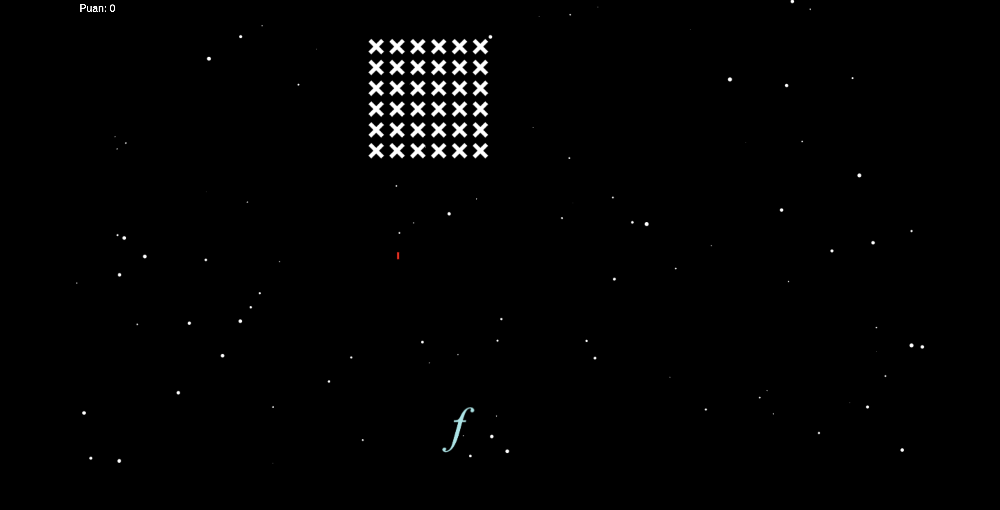
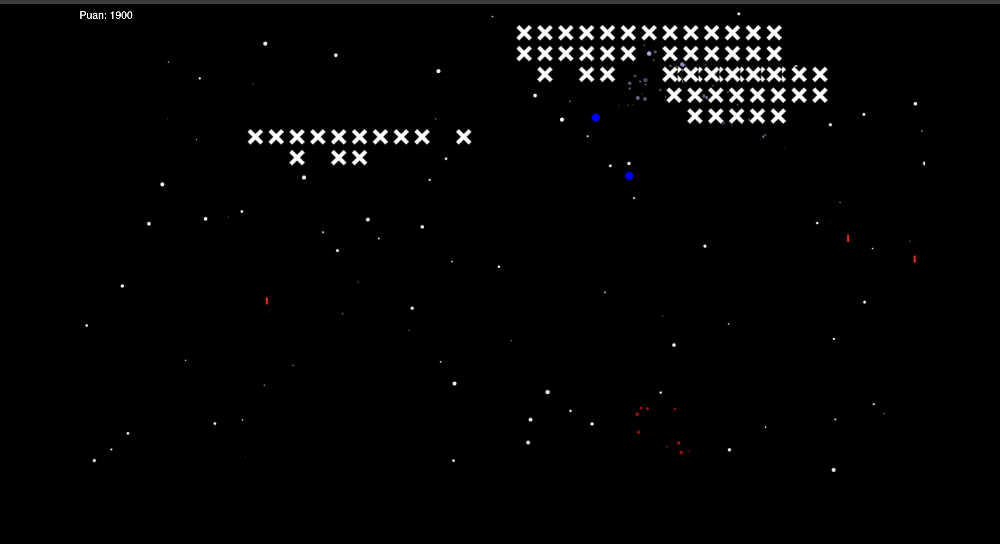

# Bilinmeyenlerden Kurtul

HTML, JavaScript ve Canvas kullanılarak yapılmış uzay temalı bir 2D nişancı oyunudur. Oyuncu, bilinmeyenlerden (düşmanlardan) gelen saldırılardan kaçarak onları yok etmeye çalışır.

## Oynanış

- **a tuşu**: Sola hareket
- **d tuşu**: Sağa hareket
- **Boşluk (Space)**: Ateş et

## Özellikler

- Düşmanlar rastgele gruplar hâlinde gelir
- Ses efektleri ve arka plan müziği
- Parçacık efektiyle patlama animasyonları
- Puan sistemi

##  Kullanılan Teknolojiler

- HTML
- CSS
- JavaScript
- Canvas
- Görseller: `./img/` klasörü
- Sesler: `./music/` klasörü

## Ekran Görüntüleri





## Oyunun Tanıtım Videosu

https://youtu.be/tKVbm0klKv0

## Kurulum ve Çalıştırma

Bu oyunu çalıştırmak için:

1. Bu projeyi bilgisayarına indir veya klonla:

```bash
git clone https://github.com/alidvc/bilinmeyenlerden-kurtul.git
```

2. Proje klasörünü aç:

```bash
cd bilinmeyenlerden-kurtul
```

3. `index.html` dosyasını bir tarayıcıda aç.

**Not:** Müzik ve görsellerin çalışması için `img/` ve `music/` klasörleri eksiksiz olmalıdır.

